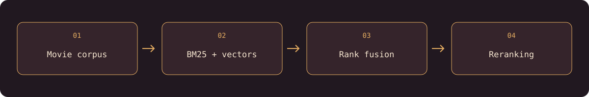

# CineSearch — Movie RAG Engine

> **Learning Journey Projects · Boot.dev**
> A student project developed through the Boot.dev curriculum and extended through hands-on practice.

**A practical movie-search engine built from first principles.**

CineSearch is a complete Retrieval-Augmented Generation (RAG) learning project. It starts with normalized keyword matching and grows into a multi-stage search system that combines BM25, dense sentence embeddings, chunk retrieval, reciprocal rank fusion, reranking, LLM query enhancement, evaluation metrics, and grounded generation.

The project is implemented as small Python command-line tools so each retrieval and generation technique can be inspected independently.

##  What it can do

- Search movie titles with an inverted index and normalized token matching.
- Rank documents with TF-IDF and BM25, including term-frequency saturation and document-length normalization.
- Encode movie descriptions with `all-MiniLM-L6-v2` and search by semantic similarity.
- Split long descriptions into overlapping sentence chunks and retrieve the best matching chunk for each movie.
- Combine lexical and semantic rankings with weighted scoring or Reciprocal Rank Fusion (RRF).
- Enhance queries with spelling correction, rewriting, or related-term expansion.
- Rerank RRF candidates individually with an LLM, in a single batch, or with a local cross-encoder.
- Evaluate search quality with Precision@K, Recall@K, and F1 score against a golden dataset.
- Generate grounded movie answers, summaries, and citation-aware responses from retrieved context.



##  Architecture

```text
data/movies.json
        │
        ├── InvertedIndex ── tokenization, stop words, stemming, BM25
        │
        ├── SemanticSearch ── movie embeddings, cosine similarity
        │
        ├── ChunkedSemanticSearch ── sentence chunks, chunk embeddings
        │
        └── HybridSearch ── weighted fusion or reciprocal rank fusion
                              │
                              ├── optional reranking
                              └── optional LLM generation
```

Keyword indexes and embedding artifacts are persisted under `cache/`. They are generated locally and ignored by Git because they are large, derived files.

##  Requirements

- Python 3.13+
- [uv](https://docs.astral.sh/uv/)
- The Boot.dev movie dataset at `data/movies.json`
- CPU or CUDA-capable hardware; this project is configured to use CPU PyTorch for portability
- An OpenRouter API key only for LLM-powered commands

##  Setup

```bash
uv sync
```

Place the dataset at `data/movies.json` with this shape:

```json
{
  "movies": [
    {"id": 1, "title": "Example film", "description": "A short movie description."}
  ]
}
```

For generation, query enhancement, LLM reranking, and LLM evaluation, create an ignored `.env` file:

```dotenv
OPENROUTER_API_KEY="your_api_key_here"
```

The default free model can be overridden without editing code:

```bash
export OPENROUTER_MODEL="your-provider/your-model"
```

The first semantic command downloads the embedding model. Later runs reuse the local model and cached vectors.

##  Build the local indexes

```bash
uv run cli/keyword_search_cli.py build
uv run cli/semantic_search_cli.py embed_chunks
```

If the movie dataset changes, rebuild the keyword index and remove stale embedding files before regenerating them:

```bash
rm -f cache/movie_embeddings.npy cache/chunk_embeddings.npy cache/chunk_metadata.json
uv run cli/keyword_search_cli.py build
uv run cli/semantic_search_cli.py embed_chunks
```

##  Search examples

<div>
  <span style="color:#e8af62">● Amber</span> `#e8af62` ·
  <span style="color:#d96c5f">● Coral</span> `#d96c5f` ·
  <span style="color:#f5e5cf">● Cream</span> `#f5e5cf` ·
  <span style="color:#211820">● Aubergine</span> `#211820`
</div>

The installed product entrypoint provides a short path for the common workflow:

```bash
uv sync
uv run cinesearch health
uv run cinesearch search "family movie about bears" --limit 5
uv run cinesearch search "family movie about bears" --mode keyword --limit 5
```

`health` reports the absolute cache location and available derived artifacts. Embedding caches now carry a dataset/model manifest, so changing the corpus or model automatically triggers a safe rebuild instead of silently using stale vectors.

###  Keyword and BM25

```bash
uv run cli/keyword_search_cli.py search "british bear"
uv run cli/keyword_search_cli.py bm25search "family movie about bears" --limit 5
uv run cli/keyword_search_cli.py tf 4651 merida
uv run cli/keyword_search_cli.py bm25tf 4651 merida
uv run cli/keyword_search_cli.py bm25idf merida
```

Keyword search preprocesses text consistently: lowercase conversion, punctuation removal, whitespace tokenization, stop-word filtering, and Porter stemming.

###  Semantic search

```bash
uv run cli/semantic_search_cli.py search "a dangerous journey through the wilderness"
uv run cli/semantic_search_cli.py search_chunked "a dangerous journey through the wilderness" --limit 5
uv run cli/semantic_search_cli.py verify
uv run cli/semantic_search_cli.py verify_embeddings
uv run cli/semantic_search_cli.py semantic_chunk "First sentence. Second sentence! Third sentence?" --max-chunk-size 2 --overlap 1
```

###  Hybrid search

Weighted search mixes normalized BM25 and semantic scores:

```bash
uv run cli/hybrid_search_cli.py weighted-search "bear adventure" --alpha 0.5 --limit 5
```

RRF combines rankings without requiring lexical and semantic scores to share a scale:

```bash
uv run cli/hybrid_search_cli.py rrf-search "family movie about bears" --limit 5
```

Optional query enhancement and reranking:

```bash
uv run cli/hybrid_search_cli.py rrf-search "britsh bear movie" --enhance spell
uv run cli/hybrid_search_cli.py rrf-search "that bear movie with marmalade" --enhance rewrite
uv run cli/hybrid_search_cli.py rrf-search "scary bear movie" --enhance expand
uv run cli/hybrid_search_cli.py rrf-search "family movie about bears" --rerank-method batch --limit 5
uv run cli/hybrid_search_cli.py rrf-search "family movie about bears" --rerank-method cross_encoder --limit 5
uv run cli/hybrid_search_cli.py rrf-search "family movie about bears" --evaluate
```

`individual`, `batch`, `spell`, `rewrite`, `expand`, and `evaluate` use OpenRouter and may be affected by model availability, rate limits, or free-tier quotas. `cross_encoder` runs locally but downloads its model on first use.

##  Grounded generation

The generation CLI retrieves movie context first, then asks an LLM to use that context:

```bash
uv run cli/augmented_generation_cli.py rag "movies about action and dinosaurs"
uv run cli/augmented_generation_cli.py summarize "movies about action and dinosaurs" --limit 5
uv run cli/augmented_generation_cli.py question "Who are the main characters in Jurassic Park?"
uv run cli/augmented_generation_cli.py citations "action movie with lasers"
```

Each command prints retrieved titles before the generated response, making the grounding context visible instead of treating the model response as an unexplained black box.

##  Evaluation

The golden dataset contains representative natural-language queries and relevant movie titles. The evaluator reports retrieval quality at a configurable K:

```bash
uv run cli/evaluation_cli.py
uv run cli/evaluation_cli.py --limit 10
```

- **Precision@K**: relevant retrieved titles divided by K.
- **Recall@K**: relevant retrieved titles divided by all relevant titles in the golden dataset.
- **F1**: the harmonic mean of precision and recall.

##  Project layout

| Path | Responsibility |
| --- | --- |
| `cli/inverted_index.py` | Tokenization, persistent inverted index, TF-IDF, and BM25 |
| `cli/lib/semantic_search.py` | Dense embeddings, sentence chunking, semantic retrieval, and chunk retrieval |
| `cli/lib/hybrid_search.py` | Weighted hybrid search and Reciprocal Rank Fusion |
| `cli/keyword_search_cli.py` | Keyword and BM25 command-line interface |
| `cli/semantic_search_cli.py` | Embedding, chunking, and semantic-search interface |
| `cli/hybrid_search_cli.py` | Hybrid search, enhancement, reranking, and evaluation interface |
| `cli/augmented_generation_cli.py` | RAG answers, summaries, questions, and citations |
| `cli/evaluation_cli.py` | Golden-dataset Precision, Recall, and F1 evaluation |
| `cli/cinesearch.py` | Unified product entrypoint and local artifact health check |
| `cli/lib/config.py` | Repository-root paths, cache paths, and embedding signatures |
| `tests/test_core.py` | Fast regression tests for core ranking and preprocessing behavior |
| `data/` | Local movie corpus and evaluation data |
| `cache/` | Generated indexes, metadata, and embedding arrays |

##  Development notes

This repository follows Boot.dev's Retrieval-Augmented Generation course, but the implementation is organized as an inspectable project rather than a single monolithic application. Each lesson is committed separately, while generated data and credentials remain local.

Run command help at any time:

```bash
uv run cli/keyword_search_cli.py --help
uv run cli/semantic_search_cli.py --help
uv run cli/hybrid_search_cli.py --help
uv run cli/augmented_generation_cli.py --help
```

Built by **[Abdulrahman M. Yaqyn](https://yaqyn.dev)** through the [Boot.dev](https://www.boot.dev) curriculum.

##  Repository hygiene

The movie corpus, generated indexes and embeddings, virtual environment, and credential files stay local. The small stop-word list and golden evaluation dataset are included in the repository.

`cli/provider_probe.py` is an optional live-provider diagnostic, not an automated test. It only sends a request when run directly and requires your own `OPENROUTER_API_KEY`. Importing it does not load credentials or call the provider.
